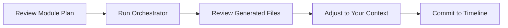
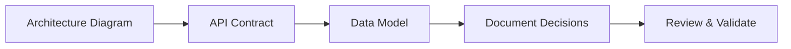
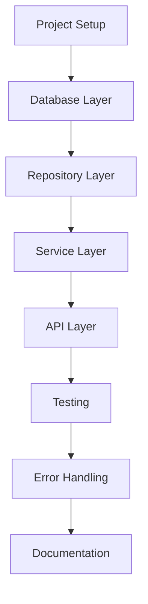
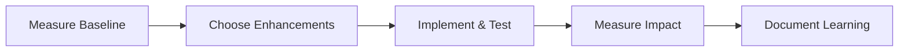
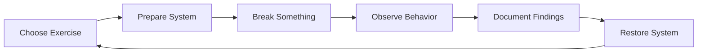
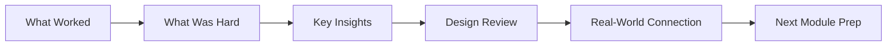

# Learning Module Prompt System - User Guide

## Overview

This directory contains a comprehensive prompt system designed to guide you through each module of your Back2Code learning journey. The prompts are **generic and reusable** across all modules, providing consistent structure while adapting to each module's specific content.

## Philosophy

**Learn by Structured Doing:**

1. **Design First** → Think before building
2. **Build Incrementally** → Small working pieces
3. **Enhance Deliberately** → Optimize with purpose
4. **Break Intentionally** → Learn from failure
5. **Reflect Deeply** → Extract maximum value

## Prompt System Components

### 1. Orchestrator

**File:** `prompt-module-orchestrator.md`
**Purpose:** Generate detailed implementation plan from module description
**When:** At start of each module, before any work
**Output:** Phase-specific markdown files with detailed tasks

### 2. Phase Prompts

**Files:**

- `prompt-phase-1-design.md` → Design artifacts and decisions
- `prompt-phase-2-implementation.md` → Step-by-step coding guidance
- `prompt-phase-3-enhancement.md` → Optimizations and polish

**Purpose:** Guide execution of each phase
**When:** During active work on each phase
**Output:** Working code, tests, documentation

### 3. Break & Observe

**File:** `prompt-break-and-observe.md`
**Purpose:** Controlled failure exercises to test resilience
**When:** After core implementation is stable
**Output:** Exercise documentation, insights, improvement ideas

### 4. Postmortem

**File:** `prompt-postmortem-reflection.md`
**Purpose:** Deep reflection to extract and solidify learning
**When:** After completing all module work
**Output:** Reflection document, lessons learned, next steps

---

## Complete Module Workflow

### Phase 0: Module Start

**Time:** 30-60 minutes



**Actions:**

1. Read module plan file (e.g., `module_1_system_design.md`)
2. Ensure `project.md` is current with your profile
3. Run orchestrator prompt (see below)
4. Review generated phase files
5. Adjust time estimates to your schedule
6. Set start date and milestones

**AI Usage:**

- Use `prompt-module-orchestrator.md`
- Provide both `@project.md` and `@[module_file].md`
- Request any clarifications needed
- Ask AI to adjust output if not suitable

---

### Phase 1: Design

**Time:** 8-12 hours typically



**Actions:**

1. Create system architecture diagram
2. Define API contracts (OpenAPI spec)
3. Design data model (ERD)
4. Document each major decision
5. Create implementation roadmap
6. Review against module objectives

**AI Usage:**

- Use `prompt-phase-1-design.md`
- Work interactively on each artifact
- Ask AI to validate design choices
- Request alternatives for comparison
- Get help documenting trade-offs

**Outputs:**

```
/module_X_[name]/
  /artifacts/
    architecture_diagram.png
    data_model_erd.png
    api_contract.yaml
  design_decisions.md
  implementation_roadmap.md
```

**Checkpoint:** All design artifacts complete, ready to code

---

### Phase 2: Implementation

**Time:** 16-20 hours typically



**Actions:**

1. Setup project structure
2. Implement each layer incrementally
3. Write tests as you go
4. Verify at each checkpoint
5. Handle errors gracefully
6. Document setup and usage

**AI Usage:**

- Use `prompt-phase-2-implementation.md`
- Work through one step at a time
- Request code examples and templates
- Get help debugging issues
- Ask for testing guidance

**Work Style:**

- Don't skip ahead
- Verify each piece works before proceeding
- Commit frequently
- Run tests after every change
- Take breaks between major steps

**Checkpoint:** All tests passing, core features working

---

### Phase 3: Enhancement

**Time:** 4-6 hours typically



**Actions:**

1. Baseline performance
2. Prioritize enhancements (3-5)
3. Implement one at a time
4. Measure improvement
5. Polish code quality
6. Complete documentation

**AI Usage:**

- Use `prompt-phase-3-enhancement.md`
- Get help prioritizing enhancements
- Request optimization strategies
- Ask for performance measurement advice
- Get refactoring suggestions

**Focus Areas:**

- Database indexing
- Advanced features (pagination, filtering, search)
- Observability (logging, metrics, health checks)
- Security hardening
- Code quality

**Checkpoint:** Enhancements complete, system optimized

---

### Phase 4: Break & Observe

**Time:** 4-6 hours typically



**Actions:**

1. Pick 5-8 exercises from plan
2. For each exercise:
   - Verify system healthy
   - Execute failure scenario
   - Observe and document behavior
   - Analyze why it behaved that way
   - Restore to working state
   - Extract lessons

**AI Usage:**

- Use `prompt-break-and-observe.md`
- Get help setting up monitoring
- Request explanation of observed behavior
- Ask about production implications
- Discuss improvement strategies

**Exercise Categories:**

- Infrastructure failures
- Invalid input / attacks
- Concurrency issues
- Performance under load
- Data integrity

**Checkpoint:** 5+ exercises completed, insights documented

---

### Phase 5: Postmortem & Reflection

**Time:** 2-4 hours



**Actions:**

1. Review time spent vs estimated
2. Document what worked well
3. Analyze challenges
4. Extract key technical insights
5. Review design decisions
6. Connect to real-world systems
7. Identify improvements for next time
8. Prepare for next module

**AI Usage:**

- Use `prompt-postmortem-reflection.md`
- Work through conversationally
- Let AI ask probing questions
- Request synthesis of learnings
- Get help connecting to career context

**Reflection Quality:**

- Be honest about struggles
- Go deep, not surface-level
- Identify concrete actions
- Connect to professional growth

**Outputs:**

```
/module_X_[name]/
  module_reflection.md
  lessons_learned.md
  next_module_prep.md
```

**Checkpoint:** Deep understanding solidified, ready for next module

---

## Quick Start Guide

### First Time Using This System

**Step 1:** Read this README completely
**Step 2:** Review `project.md` and your first module plan
**Step 3:** Run orchestrator for your first module
**Step 4:** Follow generated plan, using phase prompts as guides
**Step 5:** Complete full cycle once to understand the flow

### For Each New Module

1. **Select module:** Choose from project plan
2. **Review module file:** Understand objectives
3. **Run orchestrator:** Generate phase plans
4. **Execute phases:** Work through 1 → 2 → 3 → 4 → 5
5. **Reflect:** Complete postmortem
6. **Rest:** Take break before next module

---

## How to Use Prompts Effectively

### General Principles

1. **Don't Copy-Paste Blindly**

   - Read and understand the prompt
   - Customize with your specifics
   - Adapt to your context

2. **Work Interactively with AI**

   - Ask clarifying questions
   - Request examples
   - Get help when stuck
   - Validate your understanding

3. **Document as You Go**

   - Don't wait until end to document
   - Capture decisions immediately
   - Note why, not just what

4. **Maintain Checkpoints**
   - Verify completion before proceeding
   - Don't skip validation steps
   - Commit working code frequently

### Prompt Customization

**Replace Placeholders:**

- `[MODULE_NAME]` → actual module name
- `[PASTE OBJECTIVES]` → copy from your files
- `@[module_file].md` → actual file path

**Adjust to Your Needs:**

- Time estimates based on your pace
- Depth based on your experience
- Focus based on your interests

**Add Your Context:**

- Reference your specific background
- Connect to your career goals
- Adapt to your learning style

---

## File Organization

### Recommended Structure

```
/Back2Code/
  /ai/
    /prompts/                          ← This directory
      README.md                        ← This file
      prompt-module-orchestrator.md
      prompt-phase-1-design.md
      prompt-phase-2-implementation.md
      prompt-phase-3-enhancement.md
      prompt-break-and-observe.md
      prompt-postmortem-reflection.md
    project.md                         ← Your profile & plan
    /module_1_api/
      module_1_system_design.md        ← Module plan
      implementation_plan.md           ← Generated by orchestrator
      phase_1_design.md                ← Generated by orchestrator
      phase_2_implementation.md        ← Generated by orchestrator
      phase_3_enhancement.md           ← Generated by orchestrator
      break_and_observe.md             ← Generated by orchestrator
      design_decisions.md              ← You fill during design
      implementation_roadmap.md        ← You fill during design
      module_reflection.md             ← You fill during postmortem
      /artifacts/                      ← Diagrams, specs
      /reflections/                    ← Learning notes
    /module_2_data/
      [same structure]
  /core-api/                           ← Actual code
  /auth-service/
  /[other services]/
```

---

## Time Management Tips

### Time Boxing

- Set maximum time for each phase
- Don't perfectionism trap
- Good enough is good enough
- Capture "future improvements" for later

### Scheduling Options

**Intensive Mode:**

- Block 1-2 weeks
- Focus exclusively on module
- Complete all phases sequentially
- High momentum, requires dedicated time

**Balanced Mode:**

- Spread over 2-4 weeks
- Work 1-2 hours daily or 4-6 hours on weekends
- Natural pace, easier to sustain
- Better work-life balance

**Casual Mode:**

- Spread over 1-2 months
- Work when time permits
- Lower pressure, slower progress
- Risk of losing context

### Tracking Progress

Create simple tracker:

```markdown
# Module Progress Tracker

**Module:** [Name]
**Start Date:** [Date]
**Target Completion:** [Date]

## Phase Checklist

- [ ] Phase 0: Orchestrator run (target: [date])
- [ ] Phase 1: Design (target: [date])
- [ ] Phase 2: Implementation (target: [date])
- [ ] Phase 3: Enhancement (target: [date])
- [ ] Phase 4: Break & Observe (target: [date])
- [ ] Phase 5: Postmortem (target: [date])

## Time Log

| Date | Phase | Hours | Notes |
| ---- | ----- | ----- | ----- |
| ...  | ...   | ...   | ...   |

**Total Time:** **_ hours
**Target Time:** _** hours
```

---

## Working with AI

### Effective AI Collaboration

**Good AI Interactions:**
✅ "Help me design the data model for user notes with these requirements..."
✅ "I'm getting this error [paste error]. Here's my code [paste code]. What's wrong?"
✅ "Explain why dependency injection is beneficial in this context"
✅ "Walk me through implementing pagination step by step"

**Less Effective:**
❌ "Build my project for me"
❌ "What should I do?" (too vague)
❌ "Is this good?" (without context)
❌ "Fix this" (without understanding)

### AI as Teacher, Not Solution Provider

**AI should:**

- Guide you through thinking
- Explain concepts
- Provide examples
- Challenge assumptions
- Ask probing questions
- Validate understanding

**AI should NOT:**

- Do all the work
- Make all decisions
- Skip learning opportunities
- Provide solutions without explanation

### When to Ask AI for Help

**Design Phase:**

- Validate architectural choices
- Compare alternatives
- Explain patterns
- Review trade-offs

**Implementation Phase:**

- Explain error messages
- Debug issues
- Provide code examples
- Suggest patterns

**Enhancement Phase:**

- Optimization strategies
- Performance analysis
- Refactoring guidance

**Break & Observe:**

- Explain observed behavior
- Identify improvement opportunities
- Connect to production patterns

**Reflection:**

- Ask probing questions
- Help synthesize learnings
- Connect to career context

---

## Common Questions

### "Do I need to follow this exactly?"

No! This is a framework, not a prescription. Adapt to your:

- Learning style
- Available time
- Experience level
- Interests
- Goals

### "Can I skip phases?"

**Don't skip:**

- Design phase (thinking before coding is crucial)
- Testing (your safety net)
- Reflection (where learning solidifies)

**Can compress:**

- Enhancement phase (if time limited)
- Break & Observe (minimum 3-5 exercises)

**Can reorder:**

- Some enhancements during implementation is fine
- Some exercises during implementation if curious

### "What if I get stuck?"

1. Review design artifacts
2. Check module plan objectives
3. Ask AI specific questions
4. Research in documentation
5. Simplify and build MVP first
6. Take a break and return fresh
7. Skip and return later if needed

### "How do I know if I'm learning?"

Good indicators:

- Can explain concepts to others
- Can implement without constant reference
- Can debug issues systematically
- Can make design decisions with rationale
- Can connect to real-world systems

### "Should I share my work?"

Benefits of sharing:

- Get feedback
- Help others learning
- Build portfolio
- Practice explaining
- Accountability

Consider:

- Blog posts about learnings
- GitHub repos with documentation
- Discussions with peers
- Presentations to team

---

## Tips for Success

### Do's

✅ Take breaks between phases
✅ Commit working code frequently
✅ Document decisions immediately
✅ Test as you build
✅ Ask questions when confused
✅ Celebrate progress
✅ Connect learning to career
✅ Be honest in reflections

### Don'ts

❌ Skip design phase
❌ Rush to "just make it work"
❌ Skip tests
❌ Ignore errors or warnings
❌ Copy-paste without understanding
❌ Compare to others
❌ Be too hard on yourself
❌ Skip reflection

### Mindset

- **Growth oriented:** Mistakes are learning
- **Patient:** Understanding takes time
- **Curious:** Ask "why" repeatedly
- **Practical:** Connect theory to practice
- **Reflective:** Learn from experience
- **Iterative:** Improve progressively

---

## Troubleshooting

### "Prompts are too long"

- Extract relevant sections
- Use as reference, not script
- Adapt to your needs
- Focus on questions that matter

### "AI responses aren't helpful"

- Ask more specific questions
- Provide more context
- Rephrase your question
- Break into smaller questions

### "Falling behind schedule"

- Review time estimates
- Identify time sinks
- Simplify scope if needed
- Extend timeline (learning matters more than speed)
- Skip optional enhancements

### "Not understanding concepts"

- Slow down
- Read different resources
- Build simpler version first
- Ask AI to explain differently
- Take break and return

### "Lost motivation"

- Review why you started
- Celebrate what you've accomplished
- Take longer break
- Switch to more interesting module
- Find learning partner

---

## Module Completion Checklist

Before marking module complete:

- [ ] All core deliverables implemented
- [ ] Tests passing with good coverage
- [ ] Documentation complete (README, API docs)
- [ ] Design decisions documented
- [ ] Break & Observe exercises completed
- [ ] Postmortem reflection completed
- [ ] Code committed and organized
- [ ] Lessons learned captured
- [ ] Next module preparation done
- [ ] Celebrated completion!

---

## Next Steps

1. **Review `project.md`** - Understand your profile and goals
2. **Select first module** - Start with Module 1 recommended
3. **Run orchestrator** - Generate detailed plan
4. **Begin Phase 1** - Start designing!

---

## Support & Contribution

### Questions or Issues?

- Review prompt files for guidance
- Ask AI for clarification
- Adjust prompts to your needs

### Improvements?

- These prompts will evolve with your feedback
- Document what works / doesn't work
- Adapt prompts as you learn what helps

### Sharing?

- Consider sharing your adaptations
- Help others learning similarly
- Build community of practice

---

## Final Thoughts

This prompt system exists to:

- **Structure** your learning without constraining it
- **Guide** your work without prescribing it
- **Accelerate** your growth without rushing it
- **Document** your journey for future reference

**Remember:** The goal isn't completing modules quickly. The goal is deep, practical understanding that serves your career and leadership growth.

**You've got this!** Take it one phase at a time, stay curious, and enjoy the journey.

---

## Appendix: Quick Reference

### Prompt Files at a Glance

| File                               | Purpose                 | When to Use        | Key Output                 |
| ---------------------------------- | ----------------------- | ------------------ | -------------------------- |
| `prompt-module-orchestrator.md`    | Generate phase plans    | Module start       | Phase files with tasks     |
| `prompt-phase-1-design.md`         | Create design artifacts | Before coding      | Architecture, decisions    |
| `prompt-phase-2-implementation.md` | Guide coding            | During development | Working code & tests       |
| `prompt-phase-3-enhancement.md`    | Optimize & polish       | After core works   | Improvements & performance |
| `prompt-break-and-observe.md`      | Test resilience         | After enhancement  | Failure insights           |
| `prompt-postmortem-reflection.md`  | Extract learning        | Module end         | Deep understanding         |

### Time Estimates

- **Design:** 8-12 hours
- **Implementation:** 16-20 hours
- **Enhancement:** 4-6 hours
- **Break & Observe:** 4-6 hours
- **Reflection:** 2-4 hours
- **Total per module:** 34-48 hours (1-2 weeks intensive, 2-6 weeks casual)

### Key Files Created Per Module

```
implementation_plan.md          ← Orchestrator output
phase_1_design.md              ← Orchestrator output
phase_2_implementation.md      ← Orchestrator output
phase_3_enhancement.md         ← Orchestrator output
break_and_observe.md           ← Orchestrator output
design_decisions.md            ← You fill during Phase 1
implementation_roadmap.md      ← You fill during Phase 1
module_reflection.md           ← You fill during Phase 5
/artifacts/                    ← Diagrams and specs
```

---

**Good luck on your learning journey!** 🚀
